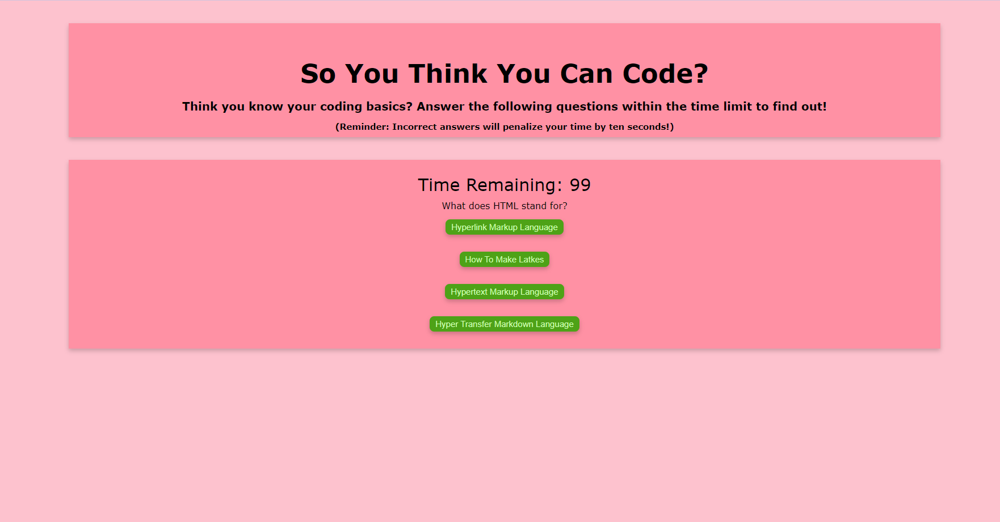

  
  # So You Think You Can Code?

  ## Table of Contents
  * [Description](#description)
  * [Usage](#usage)
  * [Contributors](#contributors)
  * [Email](#email)
  * [Github](#github)
  * [License](#license)

  ## Description
  A short quiz with a series of questions that touch on some basic HTML, CSS and JavaScript concepts. Below you can see a screenshot of the quiz as well as a link to the deployed application.
  https://otmorales23.github.io/so-you-think-you-can-code/

  
  

  ## Usage
  Click on the following link, then press the start button and take the quiz! Once you've answered the questions, you can input your initials and save your score for later. You can also view your previous scores and take the quiz as many times as you'd like!

  ## Contributors
  Oliver Terry-Morales

  ## Email
  If you have any questions please don't hesitate to reach out either via email at oliverwills0227@gmail.com or you can reach me via my LinkedIn profile at https://linkedin.com/otmorales23

  ## GitHub
  https://github.com/otmorales23

  
  ## License 
    This project is licensed with MIT

